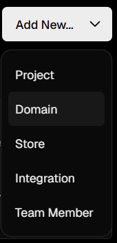
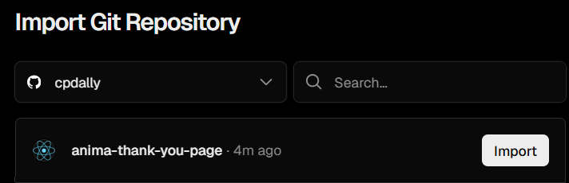
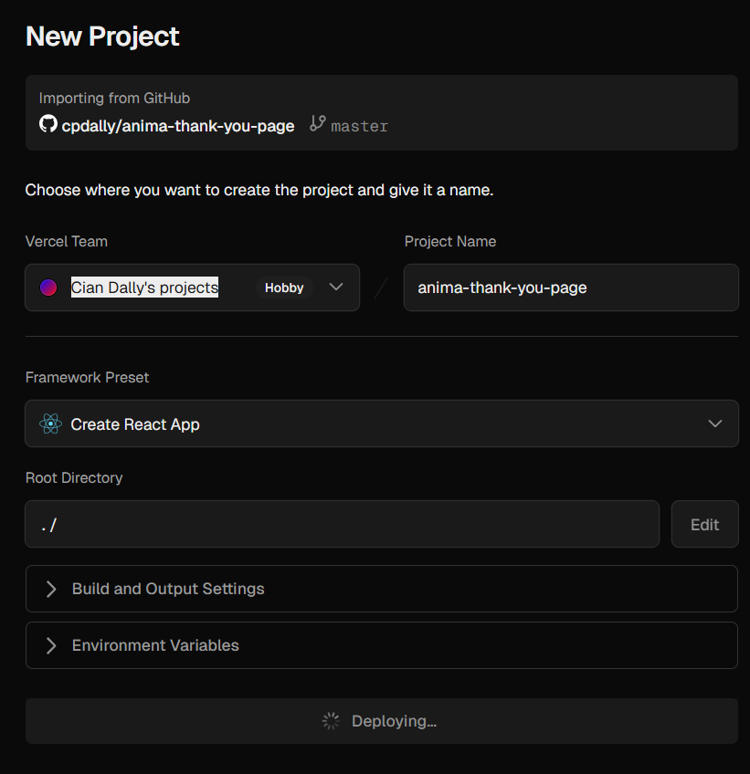
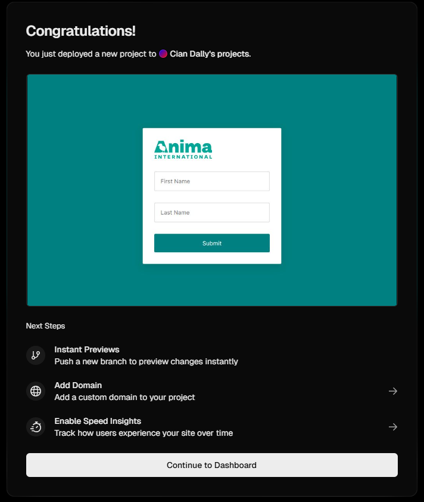

# Thank You Page

This is a simple thank-you page where a user can input their first and last name, and then download a personalized "thank you" PDF with an image from Anima International.

## Project structure

- `src/components/Form.tsx` - The form where users enter their names
- `src/utils/CreatePDF.tsx` - Handles creating the PDF
- `src/App.tsx` - Main app component
- `src/App.css` - All the styling
- `public/` - Images and logos used in the app and PDF

## Running it locally

Clone this repository, then open your terminal and navigate to the project folder:

```bash
cd anima-thank-you-page
```

Now run these commands in your terminal:

```bash
npm install
npm start
```

Open [http://localhost:3000](http://localhost:3000) and you're good to go. Type your name and hit submit to download your PDF.

## What's inside

- React + TypeScript
- jsPDF makes the PDFs
- Some CSS for styling

---

## Deployment Tutorial

### Step 1: Push your code to GitHub

Make sure all your code is committed and pushed to a GitHub repository.

### Step 2: Go to Vercel and sign in

Go to [vercel.com](https://vercel.com) and sign in with your GitHub account.

### Step 3: Click "Add New", then "Project"



### Step 4: Import your repository

Select "anima-thank-you-page" from your repositories.



### Step 5: Hit "Deploy"

Vercel will auto-detect it's a React app. Just hit "Deploy".



### Step 6: Get your live URL

Done! You'll now have a live URL. Click on the image to go to your website.

